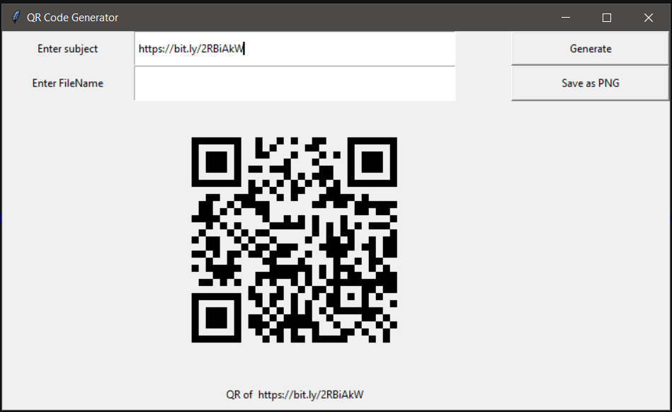

# QR-Code-Generator

###### I have created a **Tkinter GUI** to generate _QR code_. Also from the GUI we can save the generated QR code in local machine. We can convert any text, url or number to a QR code. Also we can save the file with desired name as **png file**.
 
 
##### To run the above code you might require to install pyqrcode module. Install using the command below : 
 ```python
 pip install pyqrcode
 ```
 
 
##### I have also created a video while writing the code. Watch it to know explanations of each lines written here. 
 
 Link :
 >[Learn Overflow](https://youtu.be/ErzISUgrELk)
 
 
 
### The GUI looks similar as below :
 

